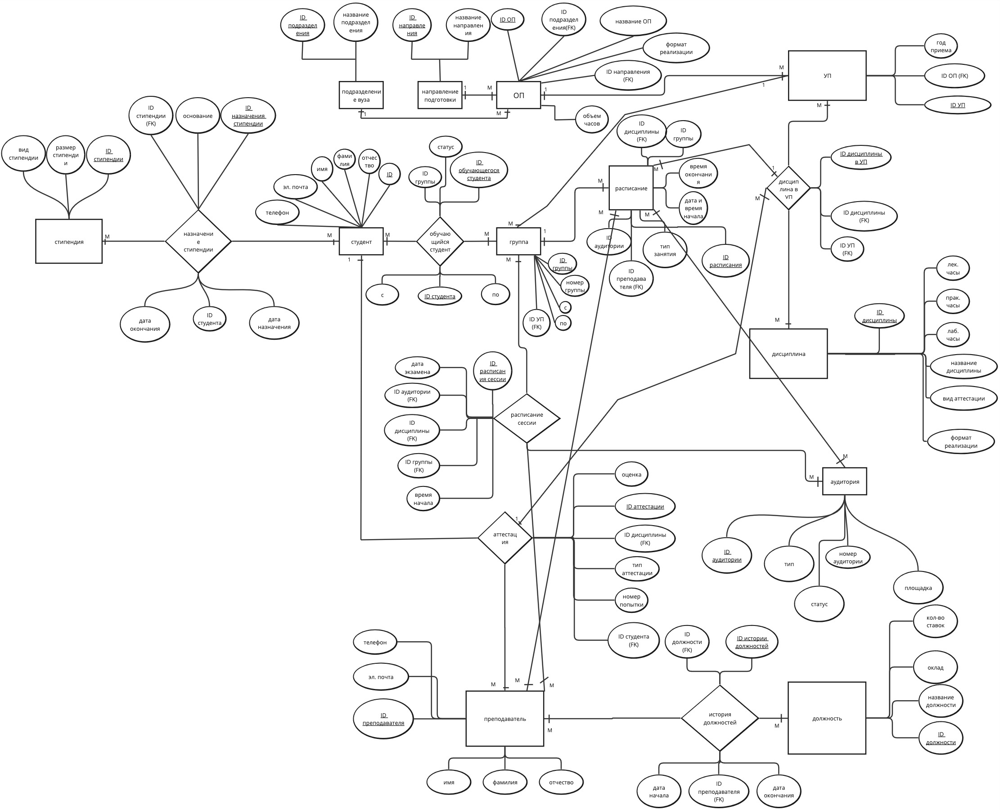
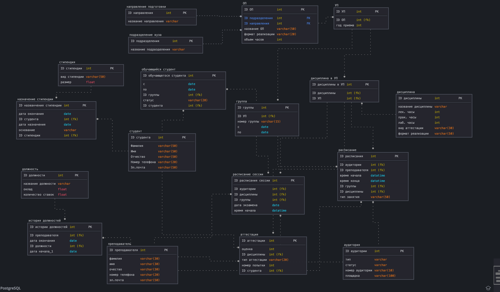

# Проект БД по теме "Сессия"

## Выполнили:

Коваленко Е., Шаповалов С.

# БД в нотации Чена-Кириллова

# БД в нотации IDEF1X

## Самодельная картинка:

## Картинка, созданная с помощью инструментов PostgreSQL:

# Ограничения на атрибуты

## Цель работы:
овладеть практическими навыками проведения анализа данных системы и построения инфологической модели данных БД методом «сущность-связь».

## Практическое задание:
1.  Проанализировать предметную область согласно варианту задания.
2.  Выполнить инфологическое моделирование базы данных по заданной предметной области с использованием метода ER-диаграмм («сущность-связь») в комбинированной нотации Питера Чена-Кириллова (задание 1.1 варианта).
3.  Реализовать разработанную ИЛМ в нотации IDEF1X.

## Индивидуальное задание
**Вариант 2. БД «Сессия»**

**Описание предметной области:**
БД содержит сведения о сдаче сессии студентами вуза. Номер зачетной книжки однозначно идентифицирует студента.

Каждый студент обучается в группе, причем номера групп меняются каждый очередной учебный год, а также при переводе студента на другое направление или при выходе из академического отпуска.

Дисциплины, по которым студенты сдают промежуточную аттестацию, соотнесены с учебным планом образовательной программы (ОП), которая в свою очередь относится к направлению подготовки, реализуемом в определенном подразделении вуза. Одно направление может реализовываться в разных подразделениях. Но каждая ОП уникальна и реализуется в одном подразделении.

По каждой дисциплине могут проводиться лекционные, лабораторные/практические занятия и практика в определенном объеме часов. По каждой дисциплине и практике проводится аттестация в формате экзамен/дифзачет/зачет.

Одна дисциплина может соотноситься с несколькими учебными планами разных направлений подготовки. Каждый учебный план относится к определенному году приема.

Экзамены проходят на различных площадках вуза, территориально расположенных в разных частях города или страны.

**БД должна содержать следующий минимальный набор сведений:**
Номер зачетной книжки. Фамилия студента. Имя студента. Отчество студента. Курс. Группа. Учебный год. Семестр. ID дисциплины/практики. Название дисциплины/практики. ID направления. Название направления. Оценка. Фамилия преподавателя. Имя преподавателя. Отчество преподавателя. Должность. ID подразделения. Подразделение. Дата сдачи экзамена/зачета/дифзачета. Аудитория. Площадка (адрес). Номер попытки (максимально 3).

**Дополнения:**
*   Дополните исходные данные информацией: по расписанию сессии, по назначению базовой и повышенной стипендии.
*   Дополните состав атрибутов на основе анализа предметной области.

## Задания
**Задание 1 (ЛР 1 БД).** Выполните инфологическое моделирование базы данных системы. (Ограничения задать самостоятельно.)

**Задание 2.** Создайте логическую модель БД, используя ИЛМ (задание 1.1). Используйте необходимые средства поддержки целостности данных в СУБД.

## Порядок выполнения задания:
1.  Изучить предметную область.
2.  Выполнить следующие этапы моделирования структур данных:
    a.  проанализировать состав объектов предметной области и атрибутов, их характеризующих;
    b.  определить вычисляемые атрибуты, которые можно не хранить в БД;
    c.  выделить сущности:
        i.  стержневые;
        ii. характеристические (зависимые): выделяются на основе анализа многозначных или составных свойств сущности;
        iii. обозначающие;
    d.  выделить связи: ассоциации между сущностями.
3.  Проанализировать свойства связей:
    a.  определить тип связи и классы принадлежности сущностей (максимальную и минимальную кардинальность связей);
    b.  проанализировать свойства связей для характеристических и обозначающих сущностей: определить тип связи и классы принадлежности сущностей;
    c.  проанализировать свойства связей: выделить атрибуты связей и определить ключи (первичные и внешние);
    d.  представить состав реквизитов сущностей в виде “название сущности (перечень реквизитов)”. Например: Студент (ID студента, фамилия, имя, отчество, номер группы, дата рождения, стипендия, оценки).
4.  На основе проведенного анализа построить схему инфологической модели в виде схемы данных (диаграммы ER-типов) в рассмотренной нотации Питера Чена.
5.  Выполнить моделирование в среде CA ERwin Data Modeler (создать модель Logical/Physical).
6.  Дать характеристику атрибутов сущностей (типизация (структурная часть) и их ограничения (целостная часть)) по следующей схеме (словарь данных). Для внешних ключей необходимо указать правила соответствия первичным ключам (для связываемых сущностей). Дать характеристику в виде таблицы согласно свойствам элементов модели в CA ERwin Data Modeler.
7.  Описать алгоритмические связи показателей (вычисляемые атрибуты) при наличии.

## Ход работы
Название создаваемой БД - **“Сессия”**.

**Состав реквизитов сущностей:**
1.  Обучающийся студент (`ID_обучающегося_студента`, `ID_студента`, `ID_группы`, `с`, `по`, `статус`)
2.  Студент (`ID`, `фамилия`, `имя`, `отчество`, `эл._почта`, `телефон`)
3.  Группа (`номер_группы`, `ID_группы`, `ID_УП`, `с`, `по`)
4.  Подразделение ВУЗа (`ID_подразделения`, `название_подразделения`)
5.  Направление подготовки (`ID_направления`, `название_направления`)
6.  ОП (`ID_ОП`, `ID_подразделения`, `название_ОП`, `ID_направления`, `формат_реализации`, `объем_часов`)
7.  УП (`ID_УП`, `ID_ОП`, `год_приема`)
8.  Дисциплина в УП (`ID_дисциплины_в_УП`, `ID_УП`, `ID_дисциплины`)
9.  Дисциплина (`ID_дисциплины`, `название_дисциплины`, `вид_аттестации`, `формат_реализации`, `лек._часы`, `прак._часы`, `лаб._часы`)
10. Аттестация (`ID_аттестации`, `ID_студента`, `ID_дисциплины`, `оценка`, `номер_попытки`, `тип_аттестации`)
11. Расписание (`ID_дисциплины`, `ID_группы`, `тип_занятия`, `дата_и_время_начала`, `время_окончания`, `ID_расписания`, `ID_преподавателя`, `ID_аудитории`)
12. Расписание сессии (`ID_расписания_сессии`, `ID_дисциплины`, `ID_группы`, `дата_экзамена`, `время_начала`, `ID_аудитории`)
13. Преподаватель (`ID_преподавателя`, `имя`, `фамилия`, `отчество`, `эл._почта`, `телефон`)
14. Должность (`ID_должности`, `название_должности`, `оклад`, `кол-во_ставок`)
15. История должностей (`ID_преподавателя`, `ID_должности`, `ID_истории_должностей`, `дата_начала`, `дата_окончания`)
16. Назначение стипендии (`ID_назначения_стипендии`, `ID_стипендии`, `основание`, `ID_студента`, `дата_назначения`, `дата_окончания`)
17. Стипендия (`ID_стипендии`, `вид_стипендии`, `размер_стипендии`)

**Схемы моделей:**
*   На рис. 1 изображена схема инфологической модели данных БД в нотации Питера Чена-Кириллова. В более хорошем качестве ИЛМ доступна по ссылке в Miro: https://miro.com/app/board/uXjVNGfu_uE=/.
*   На рис. 2 изображена схема инфологической модели данных БД в нотации IDEF1X. Примечание: все жирные точки, это максимальная кардинальность связей (Р).

**Описание атрибутов сущностей и ограничений на данные (Таблица 1):**

| Наименование атрибута         | Тип           | ПК (Собств.) | ПК (Внешн.) | FK  | Обязат. | Ограничения целостности                                                                                                  |
| :---------------------------- | :------------ | :----------: | :---------: | :-: | :-----: | :----------------------------------------------------------------------------------------------------------------------- |
| **Направление подготовки**    |               |              |             |     |         |                                                                                                                          |
| ID_направления                | INT           |      +       |      -      |  -  |    +    | Уникален, автоматически генерируется                                                                                    |
| Название_направления          | VARCHAR(50)   |      +       |      -      |  -  |    +    | Может содержать прописные/строчные буквы (кир/лат), цифры, символы `-`, ` `, `.`, `,`, `/`                                  |
| **Подразделение вуза**        |               |              |             |     |         |                                                                                                                          |
| ID_подразделения              | INT           |      +       |      -      |  -  |    +    | Уникален, автоматически генерируется                                                                                    |
| Название_подразделения        | VARCHAR(50)   |      +       |      -      |  -  |    +    | Может содержать прописные/строчные буквы (кир/лат), цифры, символы `-`, ` `, `.`, `,`, `/`                                  |
| **ОП**                        |               |              |             |     |         |                                                                                                                          |
| ID_ОП                         | INT           |      +       |      -      |  -  |    +    | Уникален, автоматически генерируется                                                                                    |
| ID_направления                | INT           |      -       |      -      |  +  |    +    | FK: `Направление подготовки(ID_направления)`                                                                            |
| ID_подразделения              | INT           |      -       |      -      |  +  |    +    | FK: `Подразделение вуза(ID_подразделения)`                                                                              |
| Название_ОП                   | VARCHAR(50)   |      +       |      -      |  -  |    +    | Может содержать прописные/строчные буквы (кир/лат), цифры, символы `-`, ` `, `.`, `,`, `/`                                  |
| Формат_реализации             | VARCHAR(50)   |      +       |      -      |  -  |    +    | Допустимые значения: `Очно`, `Дистанционно`, `Смешанный`                                                                |
| Объем_часов                   | INT           |      +       |      -      |  -  |    +    | Натуральное число, <= 10800                                                                                             |
| **Дисциплина в УП**           |               |              |             |     |         |                                                                                                                          |
| ID_дисциплины_в_УП            | INT           |      +       |      -      |  -  |    +    | Уникален, автоматически генерируется                                                                                    |
| ID_дисциплины                 | INT           |      -       |      -      |  +  |    +    | FK: `Дисциплина(ID_дисциплины)`                                                                                         |
| ID_УП                         | INT           |      -       |      -      |  +  |    +    | FK: `УП(ID_УП)`                                                                                                         |
| **УП**                        |               |              |             |     |         |                                                                                                                          |
| ID_УП                         | INT           |      +       |      -      |  -  |    +    | Уникален, автоматически генерируется                                                                                    |
| Год_приема                    | VARCHAR(4)    |      +       |      -      |  -  |    +    | Натуральное число > 1900, <= текущего учебного года                                                                     |
| ID_ОП                         | VARCHAR(50)   |      -       |      -      |  +  |    +    | FK: `ОП(ID_ОП)`                                                                                                         |
| **Группа**                    |               |              |             |     |         |                                                                                                                          |
| ID_группы                     | INT           |      +       |      -      |  -  |    +    | Уникален, автоматически генерируется                                                                                    |
| C                             | DATE          |      +       |      -      |  -  |    +    | >= '1900-01-01', <= текущая дата                                                                                        |
| Номер_группы                  | VARCHAR(15)   |      +       |      -      |  -  |    +    | Может содержать заглавные латинские буквы, цифры, символы `/`, `-`, ` `                                                   |
| По                            | DATE          |      +       |      -      |  -  |    +    | >= значение поля `С`                                                                                                    |
| ID_УП                         | INT           |      -       |      -      |  +  |    +    | FK: `УП(ID_УП)`                                                                                                         |
| **Студент**                   |               |              |             |     |         |                                                                                                                          |
| ID_студента                   | INT           |      +       |      -      |  -  |    +    | Уникален, автоматически генерируется                                                                                    |
| Фамилия                       | VARCHAR(50)   |      +       |      -      |  -  |    +    | Может содержать буквы (кир/лат), цифры, символы `-`, ` `                                                                  |
| Имя                           | VARCHAR(50)   |      +       |      -      |  -  |    +    | Может содержать буквы (кир/лат), цифры, символы `-`, ` `                                                                  |
| Отчество                      | VARCHAR(50)   |      +       |      -      |  -  |    -    | Может содержать буквы (кир/лат), цифры, символы `-`, ` `                                                                  |
| Эл._почта                     | VARCHAR(50)   |      +       |      -      |  -  |    +    | Должен содержать ровно один `@` и точку после него                                                                      |
| Номер_телефона                | VARCHAR(20)   |      +       |      -      |  -  |    +    | Первый символ `+`, остальные - цифры                                                                                    |
| **Обучающийся студент**       |               |              |             |     |         |                                                                                                                          |
| ID_обучающегося_студента      | INT           |      +       |      -      |  -  |    +    | Уникален, автоматически генерируется                                                                                    |
| Статус                        | VARCHAR(50)   |      -       |      -      |  -  |    +    | Допустимые значения: `обучение`, `академический отпуск`, `отчислен ПСЖ`, `отчислен за неуспеваемость`, `диплом`, `отчислен по переводу` |
| C                             | DATE          |      +       |      -      |  -  |    +    | >= '1900-01-01', <= текущая дата                                                                                        |
| По                            | DATE          |      +       |      -      |  -  |    +    | >= значение поля `С`                                                                                                    |
| ID_группы                     | INT           |      -       |      -      |  +  |    +    | FK: `Группа(ID_группы)`                                                                                                 |
| **Преподаватель**             |               |              |             |     |         |                                                                                                                          |
| ID_преподавателя              | INT           |      +       |      -      |  -  |    +    | Уникален, автоматически генерируется                                                                                    |
| Фамилия                       | VARCHAR(50)   |      -       |      -      |  -  |    +    | Может содержать буквы (кир/лат), цифры, символы `-`, ` `                                                                  |
| Имя                           | VARCHAR(50)   |      -       |      -      |  -  |    +    | Может содержать буквы (кир/лат), цифры, символы `-`, ` `                                                                  |
| Отчество                      | VARCHAR(50)   |      -       |      -      |  -  |    -    | Может содержать буквы (кир/лат), цифры, символы `-`, ` `                                                                  |
| Эл._почта                     | VARCHAR(50)   |      +       |      -      |  -  |    +    | Должен содержать ровно один `@` и точку после него                                                                      |
| Номер_телефона                | VARCHAR(20)   |      +       |      -      |  -  |    +    | Первый символ `+`, остальные - цифры                                                                                    |
| **История должностей**        |               |              |             |     |         |                                                                                                                          |
| Дата_начала                   | DATE          |      +       |      -      |  -  |    +    | Уникален, >= '1900-01-01', <= текущая дата                                                                             |
| ID_преподавателя              | INT           |      -       |      -      |  +  |    +    | FK: `Преподаватель(ID_преподавателя)`                                                                                   |
| Дата_окончания                | DATE          |      -       |      -      |  -  |    -    | >= значение поля `Дата начала`                                                                                          |
| ID_должности                  | INT           |      -       |      -      |  +  |    +    | FK: `Должность(ID_должности)`                                                                                           |
| **Должность**                 |               |              |             |     |         |                                                                                                                          |
| ID_должности                  | INT           |      +       |      -      |  -  |    +    | Уникален, автоматически генерируется                                                                                    |
| Название_должности            | VARCHAR(50)   |      -       |      -      |  -  |    +    | Может содержать буквы (кир/лат), цифры и символы `-`, ` `                                                                 |
| Оклад                         | FLOAT         |      -       |      -      |  -  |    +    | >= 13890                                                                                                                |
| Количество_ставок             | FLOAT         |      -       |      -      |  -  |    +    | Допустимые значения: `0.25`, `0.5`, `0.75`, `1`                                                                         |
| **Стипендия**                 |               |              |             |     |         |                                                                                                                          |
| ID_стипендии                  | INT           |      +       |      -      |  -  |    +    | Уникален, автоматически генерируется                                                                                    |
| Вид_стипендии                 | VARCHAR(50)   |      -       |      -      |  -  |    +    | Допустимые значения: `Базовая`, `ГАС`, `СГАС`, `Повышенная за отличную учебу`, `Повышенная студентам 1 курса`, `ПГАС за достижения в учебной деятельности`, `ПГАС за достижения в научной деятельности`, `ПГАС за достижения в спортивной деятельности`, `ПГАС за достижения в общественной деятельности`, `ПГАС за достижения в культурной деятельности` |
| Размер_стипендии              | FLOAT         |      -       |      -      |  -  |    +    | > 0                                                                                                                     |
| **Назначение стипендии**      |               |              |             |     |         |                                                                                                                          |
| ID_назначения_стипендии       | INT           |      +       |      -      |  -  |    +    | Уникален, автоматически генерируется                                                                                    |
| Дата_назначения               | DATE          |      -       |      -      |  -  |    +    | >= '1900-01-01', <= текущая дата                                                                                        |
| Дата_окончания                | DATE          |      -       |      -      |  -  |    -    | >= значение поля `Дата назначения`                                                                                      |
| ID_студента                   | INT           |      -       |      -      |  +  |    +    | FK: `Студент(ID_студента)`                                                                                              |
| Основание                     | VARCHAR(100)  |      -       |      -      |  -  |    +    | Шаблон: `Приказ №* о назначении стипендии*`                                                                             |
| ID_стипендии                  | INT           |      -       |      -      |  +  |    +    | FK: `Стипендия(ID_стипендии)`                                                                                           |
| **Аудитория**                 |               |              |             |     |         |                                                                                                                          |
| ID_аудитории                  | INT           |      +       |      -      |  -  |    +    | Уникален, автоматически генерируется                                                                                    |
| Тип_аудитории                 | VARCHAR(50)   |      -       |      -      |  -  |    +    | Допустимые значения: `лекционная`, `учебная`, `компьютерный класс`, `лаборатория`, `офис`                               |
| Номер_аудитории               | VARCHAR(10)   |      -       |      -      |  -  |    +    | Может содержать буквы (лат), цифры, символы `-`, `/`, ` `                                                                |
| Площадка                      | VARCHAR(100)  |      -       |      -      |  -  |    +    | Существующий адрес (город, улица, номер здания)                                                                         |
| Статус                        | VARCHAR(50)   |      -       |      -      |  -  |    +    | Допустимые значения: `В ремонте`, `Активная`, `Забронирована под мероприятие`                                            |
| **Дисциплина**                |               |              |             |     |         |                                                                                                                          |
| ID_дисциплины                 | INT           |      +       |      -      |  -  |    +    | Уникален, автоматически генерируется                                                                                    |
| Название_дисциплины           | VARCHAR(100)  |      -       |      -      |  -  |    +    | Может содержать буквы (кир/лат), цифры, символы `-`, ` `, `.`                                                              |
| лек._часы                     | INT           |      -       |      -      |  -  |    +    | >= 0, сумма (лек+лаб+прак) > 0                                                                                          |
| лаб._часы                     | INT           |      -       |      -      |  -  |    +    | >= 0, сумма (лек+лаб+прак) > 0                                                                                          |
| прак._часы                    | INT           |      -       |      -      |  -  |    +    | >= 0, сумма (лек+лаб+прак) > 0                                                                                          |
| Вид_аттестации                | VARCHAR(30)   |      -       |      -      |  -  |    +    | Допустимые значения: `Зачет`, `Экзамен`, `Дифференцированный зачет`                                                     |
| формат_реализации             | VARCHAR(50)   |      -       |      -      |  -  |    +    | Допустимые значения: `Очно`, `Дистанционно`, `Смешанный`                                                                |
| **Аттестация**                |               |              |             |     |         |                                                                                                                          |
| ID_аттестации                 | INT           |      +       |      -      |  -  |    +    | Уникален, автоматически генерируется                                                                                    |
| Оценка                        | VARCHAR(5)    |      -       |      -      |  -  |    +    | Допустимые значения: `2FX`, `3F`, `3D`, `4C`, `4B`, `5A`                                                                |
| ID_студента                   | INT           |      -       |      -      |  +  |    +    | FK: `Студент(ID_студента)`                                                                                              |
| Тип_аттестации                | VARCHAR(20)   |      -       |      -      |  -  |    +    | Допустимые значения: `Зачет`, `Экзамен`, `Дифференцированный зачет`                                                     |
| Номер_попытки                | INT           |      -       |      -      |  -  |    +    | Допустимые значения: `1`, `2`, `3`                                                                                      |
| **Расписание**                |               |              |             |     |         |                                                                                                                          |
| ID_расписания                 | INT           |      +       |      -      |  -  |    +    | Уникален, автоматически генерируется                                                                                    |
| ID_Аудитории                  | INT           |      -       |      -      |  +  |    +    | FK: `Аудитория(ID_аудитории)`                                                                                           |
| ID_преподавателя              | INT           |      -       |      -      |  +  |    +    | FK: `Преподаватель(ID_преподавателя)`                                                                                   |
| Дата_и_время_начала           | DATETIME      |      -       |      -      |  -  |    +    | >= '1900-01-01 00:00:00', <= текущий год, время в [08:00, 21:00]                                                        |
| Дата_и_время_конца            | DATETIME      |      -       |      -      |  -  |    +    | >= '1900-01-01 00:00:00', <= текущий год, время в [09:30, 22:30], время_конца > время_начала, дата_конца = дата_начала |
| ID_группы                     | INT           |      -       |      -      |  +  |    +    | FK: `Группа(ID_группы)`                                                                                                 |
| ID_дисциплины                 | INT           |      -       |      -      |  +  |    +    | FK: `Дисциплина(ID_дисциплины)`                                                                                         |
| Тип_занятия                   | VARCHAR(50)   |      -       |      -      |  -  |    +    | Допустимые значения: `Лекция`, `Практика`, `Лабораторная работа`                                                        |
| **Расписание сессии**         |               |              |             |     |         |                                                                                                                          |
| ID_расписания_сессии          | INT           |      +       |      -      |  -  |    +    | Уникален, автоматически генерируется                                                                                    |
| ID_Аудитории                  | INT           |      -       |      -      |  +  |    +    | FK: `Аудитория(ID_аудитории)`                                                                                           |
| ID_дисциплины                 | INT           |      -       |      -      |  +  |    +    | FK: `Дисциплина(ID_дисциплины)`                                                                                         |
| ID_группы                     | INT           |      -       |      -      |  +  |    +    | FK: `Группа(ID_группы)`                                                                                                 |
| Дата_и_время_начала           | DATETIME      |      -       |      -      |  -  |    +    | >= '1900-01-01 00:00:00', <= текущий год, время в [08:00, 21:00]                                                        |